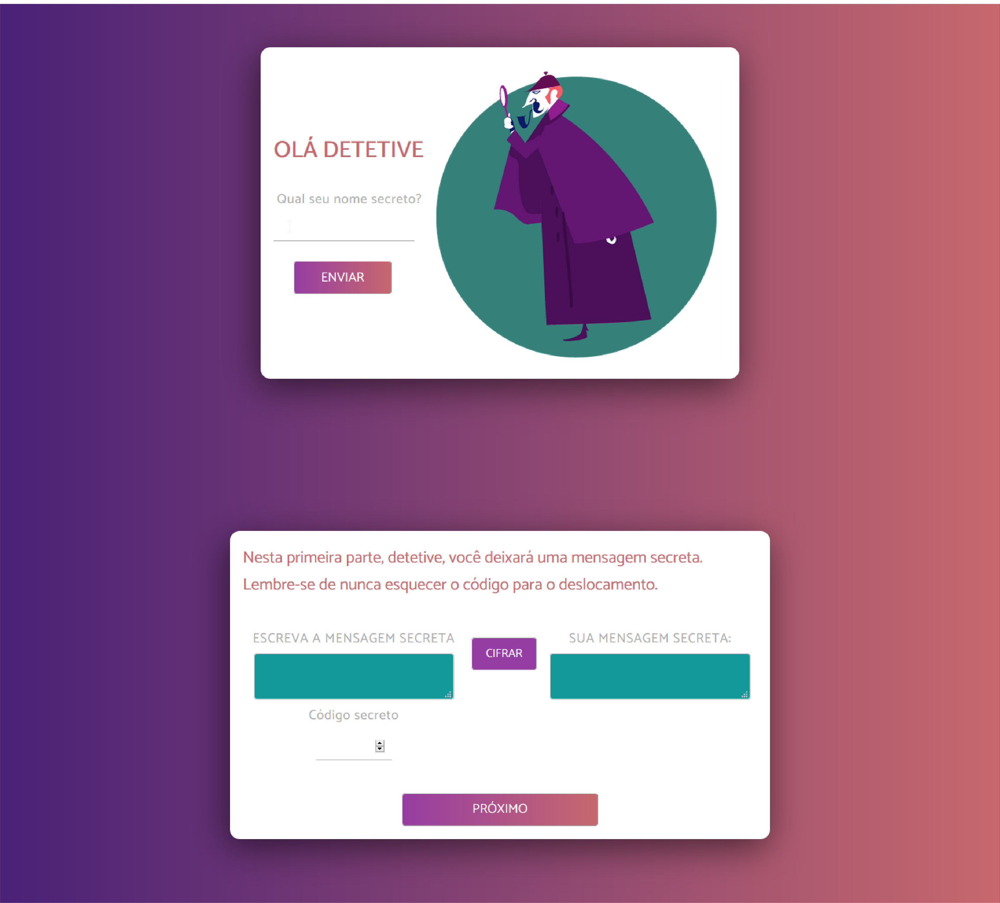

# DETETIVE JUNIOR

## Introdução
Esse é um projeto desenvolvido com CSS, HTML e JavaScript. O objetivo é cifrar e decifrar textos sem caracteres especiais utilizando Cifra de César.

A página desenvolvida permite que o usuário, este, com faixa etária entre 10 a 14 anos, utilizando como base a lógica simples e intuição para cifrar e decifrar um enigma proposto.

## Jogo

A primeira parte, logo após a tela de informar o nome, apresenta uma explicação simples sobre a cifra de César, atribuindo conhecimento sobre o assunto ao usuário. A primeira atividade permite, de forma livre, criptografar uma mensagem criada pelo usuário, afim de, baseando na tela anterior utilizar os conhecimentos adquiridos. Na página seguinte é apresentado uma tela onde detetives estão em um caso o qual o usuário deve ajudar a solucionar, exigindo do usuário atenção e intuição.

### Enredo

Formação de detetives júnior.

Primeiramente o usuário irá entender e aprender sobre criptografia, logo ele começa a aventura de auxiliar nossos detetives na decifragem de uma mensagem sobre um caso de morte. O usuário encontra uma pista na imagem usa o código e decifra a mensagem da carta. Logo ele fica livre para cifrar e decifrar quantas mensagens quiser.

# Usuários

Público-alvo: Pré-adolescentes e adolescentes entre 10 a 14 anos.

## Considerações gerais

- A chave de codificação deve ser um número positivo.
- O deslocamento das letras é feito apenas com letras simples (maiúsculas ou minúsculas); Símbolos, números e letras com acentuação não são deslocadas, são repetidas em suas posições.

**Instalação e execução**

1. [Clone](https://help.github.com/articles/cloning-a-repository/)
   o _repositório_ para seu computador (cópia local).
2. Para executar os comandos você precisará de um UNIX Shell, que é um
   programa que interpreta linhas de comando (command-line interpreter) e também
   deve ter o git instalado.  
   Se você usa um sistema operacional "UNIX-like", como GNU/Linux ou MacOS, 
   você já tem um _shell_ (terminal) instalado (e provavelmente o `git` também). 
   Se você usa Windows pode baixar a versão completa do [Cmder](https://cmder.net/) 
   que inclue o [Git bash](https://git-scm.com/download/win), embora seja recomendado que você
   teste GNU/Linux.  
   Se tem  Windows 10 ou superior pode usar o [Windows Subsystem for Linux](https://docs.microsoft.com/en-us/windows/wsl/install-win10).
3. Instale as dependências do projeto rodando o comando `npm install`.  
   Mas antes disso tenha certeza de ter instalado o [Node.js](https://nodejs.org/)
   (que inclui o [npm](https://docs.npmjs.com/)).
4. Se tudo foi bem, você deve conseguir executar os testes unitários com o comando `npm test`.
5. Para ver a interface da aplicação no navegador, use o comando `npm start`
   para iniciar o servidor web e entre na url `http://localhost:5000` no seu
   navegador.

**Feito com 🖤 por [Sofia](https://github.com/SofiaSimas)** 
